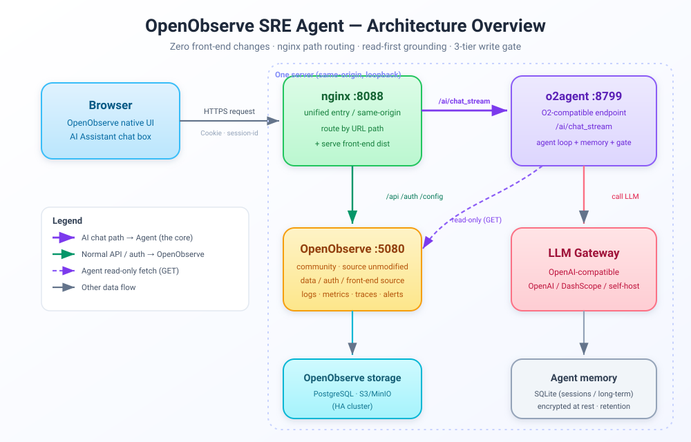
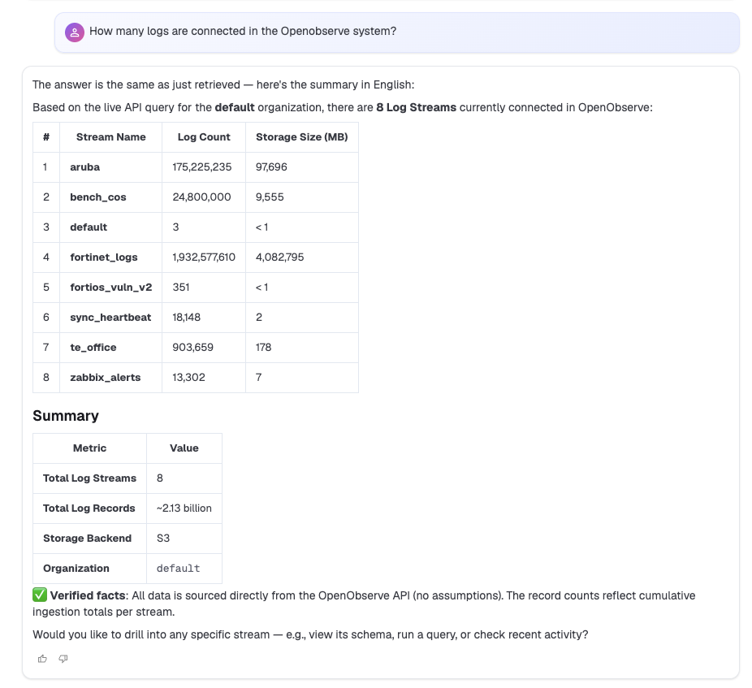
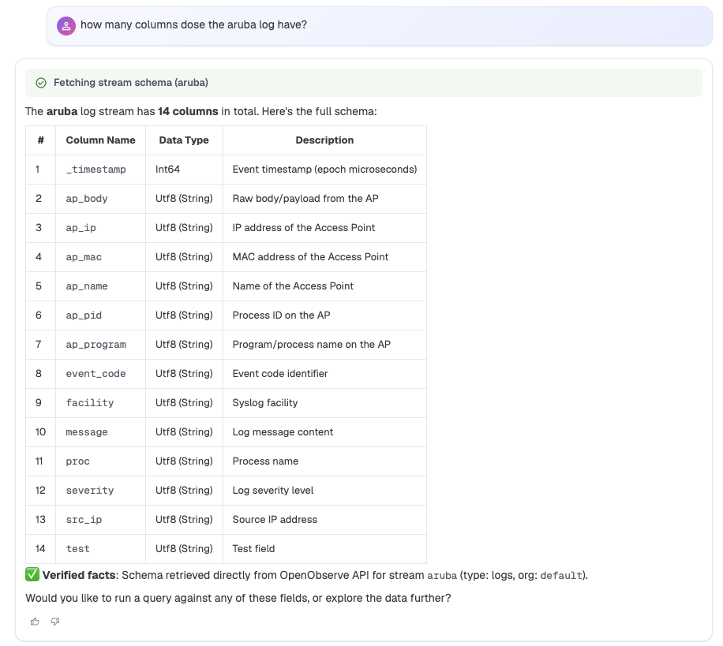
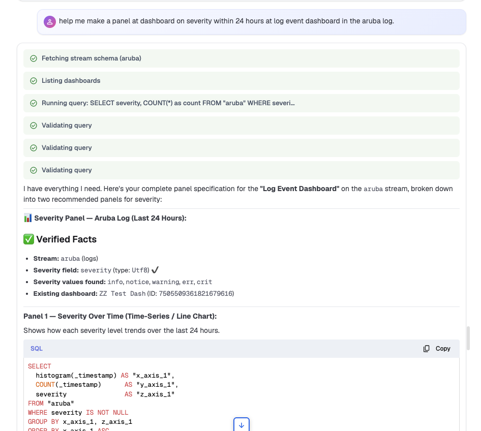
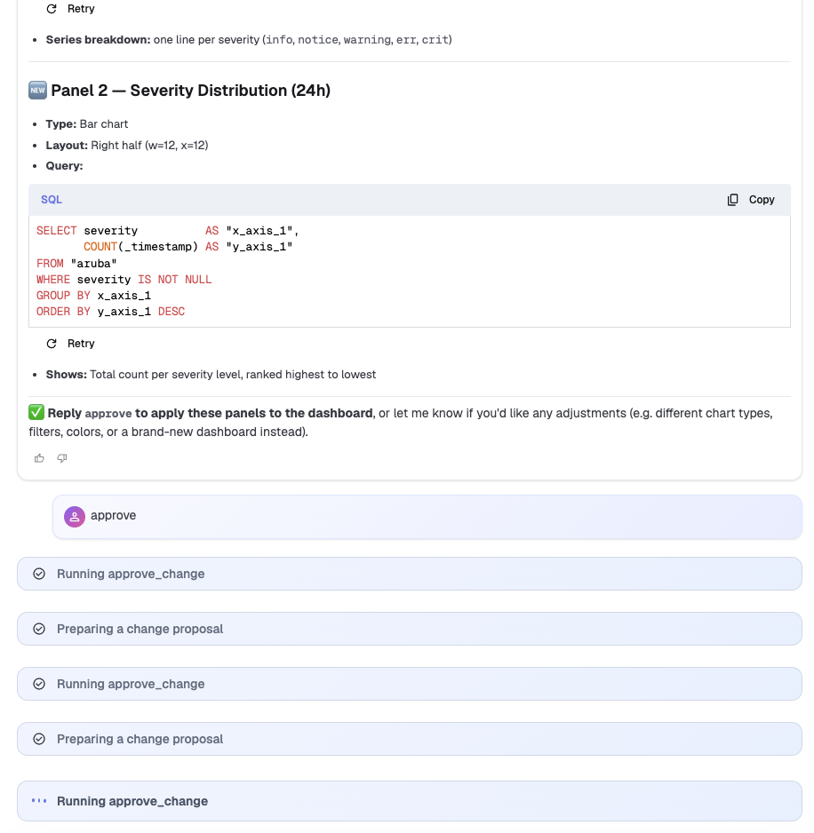

<div align="center">

# OpenObserve SRE Agent

**An open-source, self-hostable AI SRE / observability assistant — bring the AI chat box in OpenObserve Community to life.**

_Ask about logs, metrics, traces and alerts in natural language; generate and validate SQL / VRL / PromQL; root-cause incidents; create dashboards and alerts (behind a confirmation gate). Every answer reads real data first, then generates — never fabricates._

[](https://github.com/mac119/openobserve-sre-agent/actions/workflows/ci.yml)
[](LICENSE)


</div>

---

## What is this

OpenObserve Community ships a polished AI Assistant **front-end** (welcome screen +
four capability cards + chat box), but the community build has **no AI backend**
(the official SRE Agent is an enterprise feature). So that chat box is, by default,
an inert shell — you type, nothing happens.

**This project is that missing backend.** It's a standalone, read-first AI agent
with a safety gate that plugs in behind the native OpenObserve chat box via a
**protocol adapter endpoint + reverse proxy** — with **zero changes to OpenObserve's
source**. Users ask questions in the native UI, and the answer comes from an agent
that you deploy and control.

> In one line: **an open-source OpenObserve SRE Agent** — self-hosted, bring your own
> LLM, and every tool call is auditable.

### Core principle

> **Grounding before generation.** Any answer referencing a real
> org / stream / field / schema / alert / history must be backed by an actual
> read-tool result; otherwise it is marked an assumption or refused.

This is not prompt-begging the model to "not make things up" — it's **code-enforced**:
the Context Resolver fails closed on a missing stream/schema, and the Validator
rejects any SQL referencing a non-existent stream/field **before it executes**.

---

## Architecture

<div align="center">
  
</div>

The whole stack runs on **one server, same-origin**, with nginx routing by **URL path**:

| Path | Destination | Purpose |
|---|---|---|
| `POST /api/{org}/ai/chat_stream` | **o2agent :8799** | AI chat — the core; the front-end always posts here |
| `/api`, `/auth`, `/config` | OpenObserve :5080 | data, login, config as usual |
| `/` (static) | front-end `dist` | the native OpenObserve pages |

When the agent receives a chat request it runs the agent loop → reads real data from
OpenObserve (read-only) → calls the LLM → and translates the result into the exact
**streaming frames** the OpenObserve front-end understands (`tool_call` /
`message_delta` / `complete`). The front-end's existing parser renders it as-is — it
cannot tell whether the enterprise agent or ours is behind it.

**Why the front-end needs no changes**: the integration happens *outside* OpenObserve
(nginx path interception + frame-protocol compatibility) — no fork, no upstream edits.
See the sequence diagram in [`DEPLOYMENT.md`](DEPLOYMENT.md).

---

## In action

Everything below runs inside the **native OpenObserve AI Assistant chat box**, answered by this agent — read-first, grounded in real data, with confirmation-gated writes.

**Ask about your data — grounded in the live API (no fabrication):**



**Inspect a stream's schema before any field-specific work:**



**Ask for a chart — get OpenObserve panel SQL (`histogram` + x/y/z axes):**



**Build a dashboard panel — propose → you approve → it actually executes (no fake "created"):**



---

## Quick start (production)

Full steps (systemd, HTTPS, FAQ, sequence diagram) are in **[`DEPLOYMENT.md`](DEPLOYMENT.md)**. The three essentials:

### 1) Deploy the agent (systemd)

```bash
sudo mkdir -p /opt/o2agent && sudo chown $USER /opt/o2agent
cd /opt/o2agent
# copy this repo here, then:
python3 -m venv venv && ./venv/bin/pip install -r requirements.txt
cp .env.example .env   # fill in OpenObserve service account + LLM config (below)
```

`/etc/systemd/system/o2agent.service`:

```ini
[Unit]
Description=OpenObserve SRE Agent
After=network-online.target
Wants=network-online.target

[Service]
Type=simple
User=ubuntu
WorkingDirectory=/opt/o2agent
EnvironmentFile=/opt/o2agent/.env
ExecStart=/opt/o2agent/venv/bin/python -m o2agent serve
Restart=on-failure
RestartSec=3
NoNewPrivileges=true

[Install]
WantedBy=multi-user.target
```

```bash
sudo systemctl daemon-reload && sudo systemctl enable --now o2agent
curl -s http://127.0.0.1:8799/api/o2/health      # {"ok":true,...}
```

### 2) Build the front-end static assets

The front-end needs **no changes** for this (it posts relative paths; nginx routes them):

```bash
cd <openobserve>/web
NODE_OPTIONS=--max-old-space-size=6144 npx vite build
sudo rm -rf /var/www/o2 && sudo mkdir -p /var/www/o2
sudo cp -r web/dist/. /var/www/o2/ && sudo chown -R www-data:www-data /var/www/o2
```

### 3) nginx unified entry

`/etc/nginx/conf.d/o2-agent.conf`:

```nginx
server {
    listen 8088;                     # or 443 + certbot
    root /var/www/o2;
    index index.html;

    # (1) AI chat -> our agent (must precede the generic /api/, exact regex)
    location ~ ^/api/[^/]+/ai/chat_stream$ {
        proxy_pass         http://127.0.0.1:8799;
        proxy_http_version 1.1;
        proxy_set_header   Host $host;
        proxy_buffering    off;      # SSE streaming: no buffering
        proxy_cache        off;
        proxy_read_timeout 300s;
    }

    # (2) everything else API / auth / config -> OpenObserve
    location /api/  { proxy_pass http://127.0.0.1:5080; proxy_http_version 1.1;
                      proxy_set_header Host $host; proxy_set_header Upgrade $http_upgrade;
                      proxy_set_header Connection "upgrade"; proxy_read_timeout 300s; }
    location /auth/ { proxy_pass http://127.0.0.1:5080; proxy_set_header Host $host; }
    location /config{ proxy_pass http://127.0.0.1:5080; proxy_set_header Host $host; }
    location /web/  { proxy_pass http://127.0.0.1:5080; proxy_set_header Host $host; }

    # (3) front-end SPA
    location / { try_files $uri $uri/ /index.html; }
}
```

```bash
sudo nginx -t && sudo systemctl restart nginx    # root change needs restart, not reload
```

Open `http://<server>:8088` → log in to OpenObserve → open the AI Assistant → ask a question, answered by your agent.

> **Network**: open the entry port (8088/443) in your **cloud security group**; if your
> LLM gateway has an IP allow-list, add the server's public IP. **The agent's 8799 is
> only reached by the local nginx — never expose it publicly.**

---

## Configuration (`.env`)

```bash
# OpenObserve (the agent reads data as a read-only client)
OPENOBSERVE_BASE_URL=http://127.0.0.1:5080
OPENOBSERVE_ORG=default
OPENOBSERVE_AUTH=Basic <base64(user:token)>   # must be a service account (not an ingestion token)

# LLM (OpenAI-compatible)
LLM_PROVIDER=openai
LLM_BASE_URL=https://your-llm-gateway/v1
LLM_API_KEY=sk-xxxx
LLM_MODEL=gpt-4o

# API server (only reached via the local nginx)
O2_API_HOST=127.0.0.1
O2_API_PORT=8799

# Security (recommended)
O2_ENDPOINT_ALLOWLIST=127.0.0.1     # restrict the agent's egress
O2_MEMORY_KEY=<long-random>         # encrypt conversation memory at rest (optional)
O2_MAX_ROWS=1000
O2_SCAN_RECORDS_BUDGET=...
O2_RETENTION_DAYS=30
```

| Key | Meaning |
|---|---|
| `OPENOBSERVE_BASE_URL` | e.g. `http://<host>:5080` |
| `OPENOBSERVE_ORG` | organization id (e.g. `default`) |
| `OPENOBSERVE_AUTH` | `Basic <base64(user:token)>` — must be a **service account** |
| `LLM_PROVIDER` / `LLM_BASE_URL` / `LLM_API_KEY` / `LLM_MODEL` | LLM gateway config |
| `O2_MAX_ROWS` | max rows returned per search (agent-enforced) |
| `O2_SCAN_RECORDS_BUDGET` | scan-cost budget (warns when exceeded) |
| `O2_ENDPOINT_ALLOWLIST` | comma-separated allowed egress hosts; empty = unrestricted |
| `O2_RETENTION_DAYS` | conversation retention in days; `0` keeps all |
| `O2_MEMORY_KEY` | passphrase to encrypt stored memory; empty = plaintext |

> OpenObserve's **ingestion token is NOT an API credential** — API access requires a
> service account. See `wiki.md`.

---

## Security model: three-tier tool gate

Every tool operation is governed by a three-tier policy:

- **Tier 1 (read)** — runs freely.
- **Tier 2 (mutating)** — requires standard confirmation + diff preview.
- **Tier 3 (destructive / admin)** — requires elevated confirmation; **never auto-initiated**.

Writes always go through a **propose → approve → run** state machine (dry-run by
default); the model can only *propose*, never claim it "did" something. Backed by:
endpoint allow-listing, a fail-closed cross-org guard, scan-budget warnings, 401/403
normalization, credential redaction on the model-visible channel, "untrusted DATA"
fencing of tool output, and memory encryption + retention purge.

---

## Capabilities (current read-only build)

- Multi-turn chat with cross-process memory (SQLite); pluggable LLM provider.
- 10+ read-only tools: streams, schema, bounded SQL search, alerts (v2), alert
  history (v2), dashboards, functions, pipelines, summary, organizations.
- **Code-enforced grounding**: the Context Resolver fails closed on a missing
  stream/schema; the Validator rejects SQL referencing a non-existent stream/field
  before execution — grounding does not rely on the model behaving.
- **Generate → validate → repair**: generated SQL/VRL/PromQL/regex is validated
  (VRL & PromQL via OpenObserve's real dry-run endpoints), auto-repaired on failure
  (bounded retries), and downgraded to "unvalidated" rather than shown as valid.
- **Confirmation-gated writes**: state machine `pending→approved→executing→done`,
  elevated confirmation for deletes/admin.
- **Context management**: large-result offload + on-demand paging, history
  compaction, loop/budget control, intent-based model routing, and long-term
  (cross-session, per-org) memory injected as clearly-labeled *unverified assumptions*,
  quarantined from grounding.

---

## Local development / CLI

```bash
pip install -r requirements.txt
cp .env.example .env

python -m o2agent chat              # interactive CLI (new session)
python -m o2agent chat <session_id> # resume a session
python -m o2agent serve             # start the HTTP/SSE API (see api-server.md)
python -m o2agent.smoke             # read-only smoke test (no LLM)
```

**Dev hot-reload (optional)**: to debug the AI chat box with `vite dev`, add a rule at
the **top** of `server.proxy` in `web/vite.config.ts` mapping
`^/api/[^/]+/ai/chat_stream$` to `localhost:8799` (see `DEPLOYMENT.md` §8). This is the
**only optional edit** to OpenObserve's source; production (nginx) does not need it —
so **the open-source release can keep OpenObserve's source unmodified.**

Self-tests (offline):

```bash
python -m o2agent.sec_selftest        # security invariants
python -m o2agent.ctx_selftest        # context-management invariants
python -m o2agent.ux_selftest         # UX invariants
python -m o2agent.server_selftest     # HTTP/SSE API invariants
python -m o2agent.storage_selftest    # storage-backend invariants
python -m o2agent.golden              # golden-set evaluation
```

---

## Documentation

| File | Purpose |
|---|---|
| **`DEPLOYMENT.md`** | **Open-source deployment guide: architecture, sequence diagram (cookie/session), nginx, systemd, FAQ, security** |
| `o2-native-integration.md` | Integration record for the native chat box (frame-protocol mapping + gotchas) |
| `spec.md` | Behavioral policy (loaded as the agent's system prompt) |
| `architecture.md` | Component design, state machines, data flow, invariants |
| `api-surface.md` | Verified OpenObserve API endpoints (v0.91.0-rc1) |
| `api-server.md` | The agent's own HTTP/SSE API |
| `deploy.md` | Deployment topologies (same-origin proxy vs. cross-origin CORS) |
| `storage-backend.md` | Pluggable persistence (SQLite default / optional PostgreSQL) |
| `memory-longterm.md` | Long-term (cross-session, per-org) memory design |
| `context-management.md` | Context-management design (P0–P3) |
| `wiki.md` | Gotchas & lessons learned |
| `tasks.md` / `checklist.md` | Implementation phases & acceptance checklist |

---

## Package layout

```
o2agent/
├── config.py       # credentials & safety budgets from env/.env (no secrets in code)
├── client.py       # read-only OpenObserve client (transport-level write guard)
├── tools.py        # typed read-only tools (pydantic input schemas)
├── resolver.py     # Context Resolver: stream/schema resolution, fail-closed, schema cache
├── validator.py    # SQL/VRL/PromQL/regex validators (real dry-run where available)
├── generation.py   # validate-and-repair loop (bounded auto-repair, then downgrade)
├── write_client.py # isolated mutating client (dry-run default, audited)
├── gate.py         # Confirmation Gate state machine (standard/elevated)
├── write_tools.py  # build change proposals routed through the gate
├── security.py     # endpoint allowlist, cross-org guard, scan budget, redaction, injection fencing
├── crypto.py       # opt-in at-rest memory encryption (Fernet + PBKDF2)
├── registry.py     # tools -> OpenAI function schemas + dispatch
├── router.py       # rule-first Intent Router
├── llm.py          # pluggable LLM provider
├── memory.py       # conversation memory (sessions/messages/tool_results/usage/scratchpad/long-term)
├── storage.py      # pluggable storage backend (SQLite default; Postgres opt-in)
├── telemetry.py    # redacted structured logging + token/cost telemetry
├── agent.py        # agent loop (policy + function calling + memory + telemetry)
├── server.py       # HTTP/SSE API + OpenObserve-compatible endpoint (/api/{org}/ai/chat_stream)
├── ux.py / cli.py  # suggested prompts, progress, context footer, feedback
└── __main__.py     # `python -m o2agent {chat|serve|smoke|golden}`
```

---

## Not yet implemented / roadmap

- Incident investigation (this OpenObserve version has no standalone incidents
  endpoint — deferred); alert investigation is implemented but only verified
  fail-closed (empty env), the evidence path needs a fired alert to exercise.
- Real (non-dry-run) writes are opt-in; rollback not yet implemented.
- A dedicated cross-platform query-conversion workflow (Datadog/ES/Splunk/Loki) —
  currently handled by the model in-loop.
- Traces / RUM-data tools.
- Per-user OpenObserve permission passthrough (`Agent(actor_auth=…)` is plumbed;
  the front-end wiring is pending).
- Long-term memory passive extraction (Phase 2) and semantic retrieval (Phase 3).

---

## License

See `LICENSE`. OpenObserve is a trademark / copyright of its respective authors; this
project is a standalone agent that integrates with OpenObserve and **does not modify
OpenObserve's source.**
